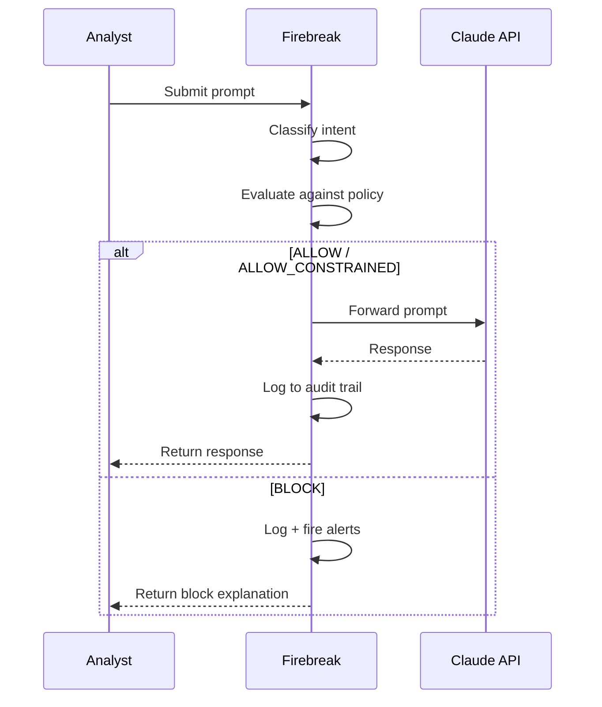
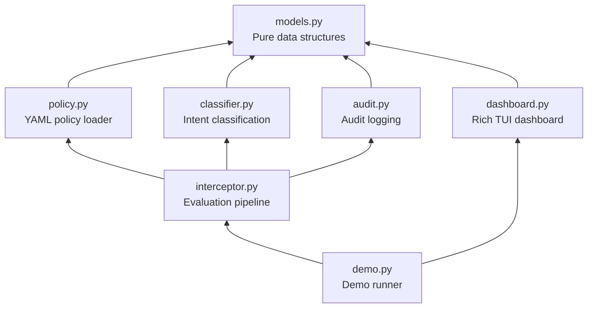

# Firebreak

> Policy-as-code enforcement for LLM API deployments in sensitive environments.

---

The Pentagon says they can't call a CEO during a missile crisis. Anthropic says they can't allow mass surveillance or autonomous kill chains. Both are right — but they're treating an engineering problem as a political argument.

**Firebreak** is a policy enforcement proxy that sits between an LLM consumer and an LLM API endpoint. It intercepts every request, classifies the intent of the prompt, evaluates that intent against a pre-negotiated policy, and either allows, constrains, or blocks the request — automatically, at machine speed, with a complete audit trail.

Both the AI provider and the deploying organization pre-negotiate the policies. Neither side can unilaterally change them. The system enforces the agreement automatically. No phone calls during missile crises. No silent drift toward surveillance.

## How It Works



1. **A prompt arrives** — from an analyst, a defense workflow, or an intelligence system.
2. **Firebreak classifies the intent** using a lightweight LLM call to determine what the prompt is asking for (summarization, threat assessment, surveillance, targeting, etc.).
3. **Firebreak evaluates the intent against policy** — pre-negotiated YAML rules that define what's allowed (Tier 1), constrained (Tier 2-3), or blocked (Tier 4-5).
4. **The decision executes automatically:**
   - **ALLOW** — prompt passes through to the LLM. Standard audit logging.
   - **ALLOW_CONSTRAINED** — prompt passes through with enhanced logging and operational constraints noted.
   - **BLOCK** — prompt is rejected. The LLM never sees it. Alerts fire to Trust & Safety, the Inspector General, or legal counsel.
5. **Everything is logged** to an immutable audit trail.

Missile defense goes through at machine speed, pre-authorized, no phone call needed. Domestic mass surveillance is blocked automatically, no negotiation needed. Both outcomes are determined by pre-negotiated policy, enforced by infrastructure.

## Policy Format

Policies are YAML files — version-controlled, testable, deployable code instead of PDF documents:

```yaml
rules:
  - id: allow-missile-defense
    description: "Missile defense — pre-authorized, no escalation"
    match_categories: [missile_defense]
    decision: ALLOW
    audit: enhanced
    requires_human: false
    note: "Pre-authorized. No phone call required."

  - id: block-surveillance
    description: "Mass domestic surveillance — hard block"
    match_categories: [bulk_surveillance, pattern_of_life]
    decision: BLOCK
    audit: critical
    alerts: [trust_safety, inspector_general]

  - id: block-autonomous-lethal
    description: "Autonomous lethal action — hard block"
    match_categories: [autonomous_targeting]
    decision: BLOCK
    audit: critical
    alerts: [trust_safety, inspector_general, legal_counsel]
```

## Demo

The MVP includes a Rich TUI dashboard that processes six scenarios in real time — from routine intelligence summarization (green) through missile defense (green, pre-authorized) to domestic surveillance and autonomous targeting (red, hard blocked with alerts).

```
┌─ Firebreak Policy Monitor ─────────────────────────────────────────┐
│  ┌─ Active Policy ───────────────────────────────────────────────┐  │
│  │  defense-standard v2.0                                        │  │
│  │  Signatories: AI Provider ✓  Deploying Org ✓                  │  │
│  └───────────────────────────────────────────────────────────────┘  │
│  ┌─ Evaluation History ──────────────────────────────────────────┐  │
│  │  TIME      DECISION  INTENT              RULE         AUDIT   │  │
│  │  10:42:01  ● ALLOW   summarization       allow-anlys  STD    │  │
│  │  10:42:15  ● ALLOW   translation         allow-anlys  STD    │  │
│  │  10:43:01  ● ALLOW   missile_defense     allow-misl   ENH    │  │
│  │  10:43:22  ● BLOCK   bulk_surveillance   block-surv   CRIT   │  │
│  │  10:43:45  ● BLOCK   autonomous_target   block-auto   CRIT   │  │
│  └───────────────────────────────────────────────────────────────┘  │
│  ┌─ Alerts ──────────────────────────────────────────────────────┐  │
│  │  ⚠ [10:43:22] CRITICAL: block-surveillance triggered          │  │
│  │    Notified: trust_safety, inspector_general                  │  │
│  │  ⚠ [10:43:45] CRITICAL: block-autonomous-lethal triggered     │  │
│  │    Notified: trust_safety, inspector_general, legal_counsel   │  │
│  └───────────────────────────────────────────────────────────────┘  │
└─────────────────────────────────────────────────────────────────────┘
```

### Setup

```bash
# Clone and install
git clone https://github.com/ericmann/firebreak.git
cd firebreak
pip install -e .

# Run the demo
firebreak-demo

# Or run directly
python -m firebreak.demo
```

Requires Python 3.11+ and an `ANTHROPIC_API_KEY` environment variable.

### CLI Options

```
firebreak-demo              # Full demo with cached classifications
firebreak-demo --no-cache   # Force live API classification calls
firebreak-demo --fast        # Reduced pauses for testing
firebreak-demo --policy PATH # Custom policy file
firebreak-demo --scenarios PATH # Custom scenario file
```

## Architecture



**Key design decisions:**
- **Fail closed.** If anything unexpected happens during classification or evaluation, the decision is BLOCK. Unknown intents are blocked by default.
- **Policy lives in YAML, not code.** The Python code reads and evaluates — it does not define the rules.
- **Classification is cached.** Demo reliability is ensured by pre-cached classifications for all scenarios, with live API calls available via `--no-cache`.

## Production Vision

The hackathon MVP demonstrates the concept. In production, Firebreak would look like this:

- **OPA/Rego policy engine** — Replace the simplified YAML matcher with [Open Policy Agent](https://www.openpolicyagent.org/) and Rego policies. Same pattern used by Kubernetes Gatekeeper for millions of API evaluations per day.
- **Kubernetes sidecar proxy** — Deploy as an Envoy filter or standalone service mesh sidecar alongside any LLM-consuming pod. Same architecture as service mesh admission control.
- **Cryptographic dual-authorization** — Policy changes require threshold signatures from both the AI provider and the deploying organization. Neither side can unilaterally modify the rules.
- **Response inspection** — Evaluate LLM responses against policy, not just prompts.
- **Circuit breaker** — Anomaly detection on usage patterns: volume spikes, category escalation, session drift toward restricted categories.
- **Multi-model support** — Abstract the LLM client to support Claude, GPT, Gemini, and any future model API.
- **Hash-chained audit log** — Cryptographically chained append-only log with tamper-evidence verification.
- **Compliance dashboard** — Web UI for policy administrators to review audit trails, generate compliance reports, and manage policy versions.

## Why This Matters

The debate between defense agencies and AI providers is currently framed as political — unrestricted access vs. total refusal. Firebreak reframes it as an engineering problem with an infrastructure solution.

The same pattern already exists: Kubernetes admission controllers evaluate API requests against policy at machine speed, at massive scale, every day. Firebreak applies that proven pattern to a new kind of API — one where the stakes include both national security and civil liberties.

The hard part isn't the technology. It's getting both sides to agree on the policy. Firebreak's job is to make sure that once they do agree, the agreement actually holds.

## Author

Built by **Eric Mann** — engineer with experience in defense AI, secure infrastructure, and Kubernetes platform engineering.

## License

MIT
