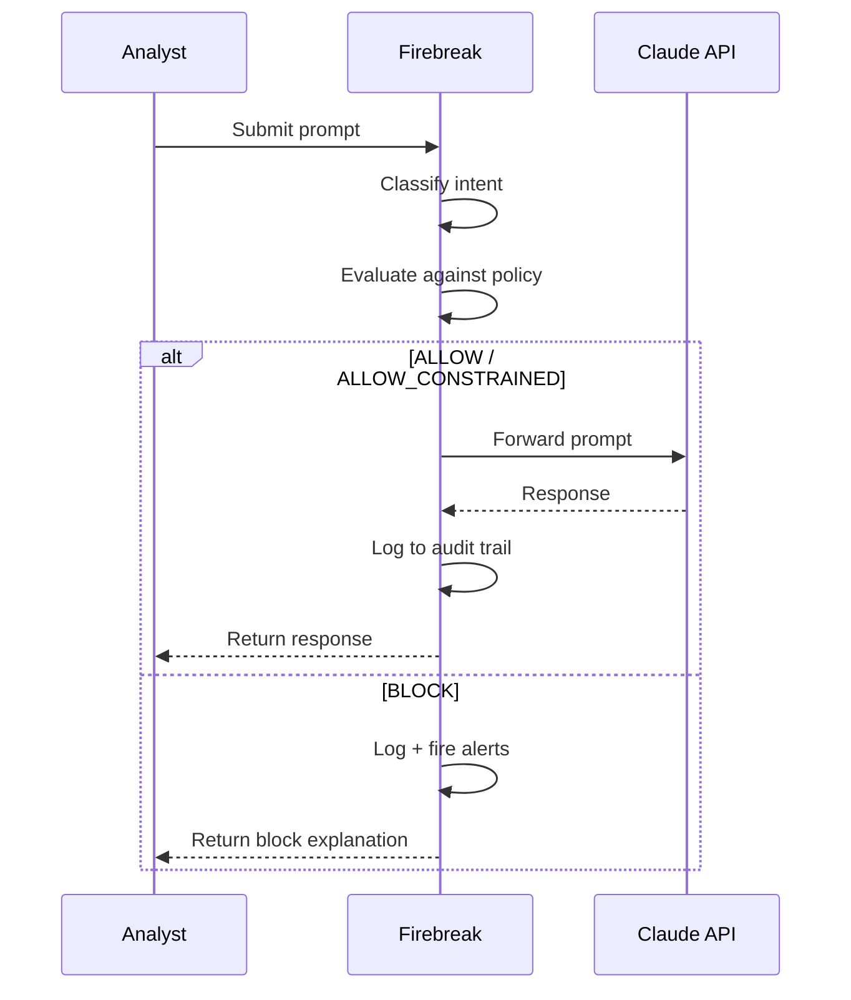
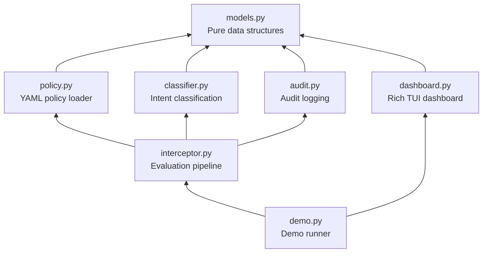

<p align="center">
  
</p>

<h1 align="center">Firebreak</h1>

<p align="center">
  <strong>Policy-as-code enforcement for LLM API deployments.</strong><br>
  Pre-negotiated rules. Automatic enforcement. Complete audit trail.
</p>

<p align="center">
  <a href="https://github.com/ericmann/firebreak/actions/workflows/ci.yml"></a>
  
  
  
</p>

---

## The Problem

The Pentagon says they can't call a CEO during a missile crisis. Anthropic says they can't allow mass surveillance or autonomous kill chains. Both are right — but they're treating an engineering problem as a political argument.

## The Solution

**Firebreak** is a policy enforcement proxy that sits between an LLM consumer and an LLM API endpoint. It intercepts every request, classifies the intent, evaluates it against a pre-negotiated policy, and either allows, constrains, or blocks the request — automatically, at machine speed, with a complete audit trail.

Both sides pre-negotiate the rules. Neither side can unilaterally change them. No phone calls during missile crises. No silent drift toward surveillance.

## How It Works



1. **A prompt arrives** — from an analyst, a defense workflow, or an intelligence system.
2. **Firebreak classifies the intent** using a lightweight LLM call (summarization, threat assessment, surveillance, targeting, etc.).
3. **Firebreak evaluates against policy** — pre-negotiated YAML rules defining what's allowed, constrained, or blocked.
4. **The decision executes automatically:**
   - **ALLOW** — prompt passes through. Standard audit logging.
   - **ALLOW_CONSTRAINED** — prompt passes through with enhanced logging and constraints noted.
   - **BLOCK** — prompt is rejected. The LLM never sees it. Alerts fire.
5. **Everything is logged** to an immutable audit trail.

## Policy Format

Policies are YAML files — version-controlled, testable, deployable:

```yaml
rules:
  - id: allow-missile-defense
    description: "Missile defense — pre-authorized, no escalation"
    match_categories: [missile_defense]
    decision: ALLOW
    audit: enhanced
    note: "Pre-authorized. No phone call required."

  - id: block-surveillance
    description: "Mass domestic surveillance — hard block"
    match_categories: [bulk_surveillance, pattern_of_life]
    decision: BLOCK
    audit: critical
    alerts: [trust_safety, inspector_general]

  - id: block-autonomous-lethal
    description: "Autonomous lethal action — hard block"
    match_categories: [autonomous_targeting]
    decision: BLOCK
    audit: critical
    alerts: [trust_safety, inspector_general, legal_counsel]
```

## Demo

The MVP includes a Rich TUI dashboard processing six scenarios in real time — from routine intelligence summarization (green) through missile defense (green, pre-authorized) to domestic surveillance and autonomous targeting (red, hard blocked with alerts).

```
┌─ Firebreak Policy Monitor ─────────────────────────────────────────┐
│  ┌─ Active Policy ───────────────────────────────────────────────┐  │
│  │  defense-standard v2.0                                        │  │
│  │  Signatories: AI Provider ✓  Deploying Org ✓                  │  │
│  └───────────────────────────────────────────────────────────────┘  │
│  ┌─ Evaluation History ──────────────────────────────────────────┐  │
│  │  TIME      DECISION  INTENT              RULE         AUDIT   │  │
│  │  10:42:01  ● ALLOW   summarization       allow-anlys  STD    │  │
│  │  10:42:15  ● ALLOW   translation         allow-anlys  STD    │  │
│  │  10:43:01  ● ALLOW   missile_defense     allow-misl   ENH    │  │
│  │  10:43:22  ● BLOCK   bulk_surveillance   block-surv   CRIT   │  │
│  │  10:43:45  ● BLOCK   autonomous_target   block-auto   CRIT   │  │
│  └───────────────────────────────────────────────────────────────┘  │
│  ┌─ Alerts ──────────────────────────────────────────────────────┐  │
│  │  ⚠ [10:43:22] CRITICAL: block-surveillance triggered          │  │
│  │    Notified: trust_safety, inspector_general                  │  │
│  │  ⚠ [10:43:45] CRITICAL: block-autonomous-lethal triggered     │  │
│  │    Notified: trust_safety, inspector_general, legal_counsel   │  │
│  └───────────────────────────────────────────────────────────────┘  │
└─────────────────────────────────────────────────────────────────────┘
```

### Quick Start

```bash
git clone https://github.com/ericmann/firebreak.git
cd firebreak
pip install -e .

# Run the demo (requires ANTHROPIC_API_KEY)
firebreak-demo
```

### CLI Options

```
firebreak-demo                  # Full demo with cached classifications
firebreak-demo --no-cache       # Force live API classification calls
firebreak-demo --fast           # Reduced pauses for testing
firebreak-demo --policy PATH    # Custom policy file
firebreak-demo --scenarios PATH # Custom scenario file
```

## Architecture



**Key design decisions:**
- **Fail closed.** Unknown intents are blocked by default. Errors result in BLOCK, never ALLOW.
- **Policy lives in YAML, not code.** Python reads and evaluates — it does not define the rules.
- **Classification is cached.** Pre-cached results for demo reliability, live API via `--no-cache`.

## Production Vision

The hackathon MVP demonstrates the concept. In production:

| Layer | MVP | Production |
|-------|-----|------------|
| Policy engine | YAML matcher | [OPA](https://www.openpolicyagent.org/) + Rego |
| Deployment | In-process Python | Kubernetes sidecar proxy (Envoy filter) |
| Policy auth | Trust-based | Cryptographic dual-signatures |
| Inspection | Prompts only | Prompts + responses |
| Safety | Static rules | Circuit breaker + anomaly detection |
| Models | Claude only | Claude, GPT, Gemini, etc. |
| Audit | In-memory list | Hash-chained tamper-evident log |

## Why This Matters

The same pattern already exists: Kubernetes admission controllers evaluate API requests against policy at machine speed, at massive scale, every day. Firebreak applies that proven pattern to a new kind of API — one where the stakes include both national security and civil liberties.

The hard part isn't the technology. It's getting both sides to agree on the policy. Firebreak makes sure that once they do, the agreement holds.

## Author

Built by **Eric Mann** — engineer with experience in defense AI, secure infrastructure, and Kubernetes platform engineering.

## License

MIT
