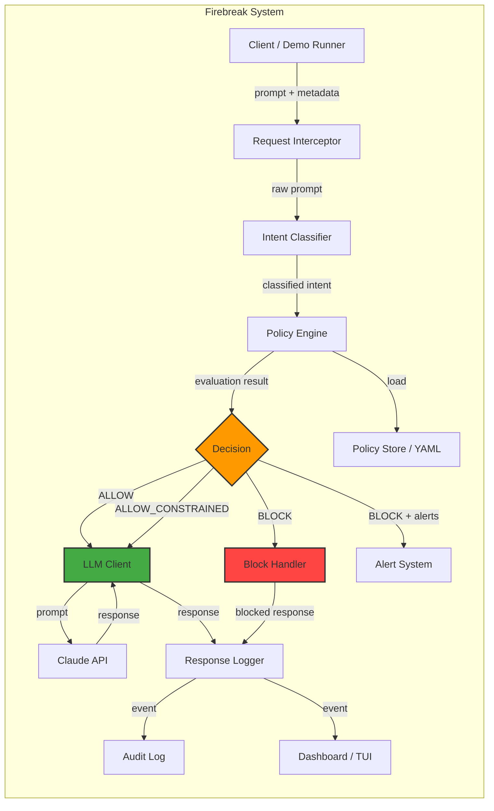
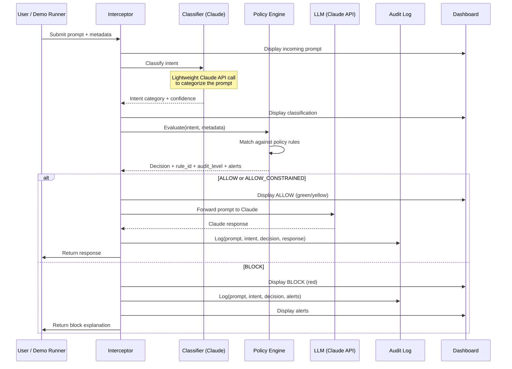
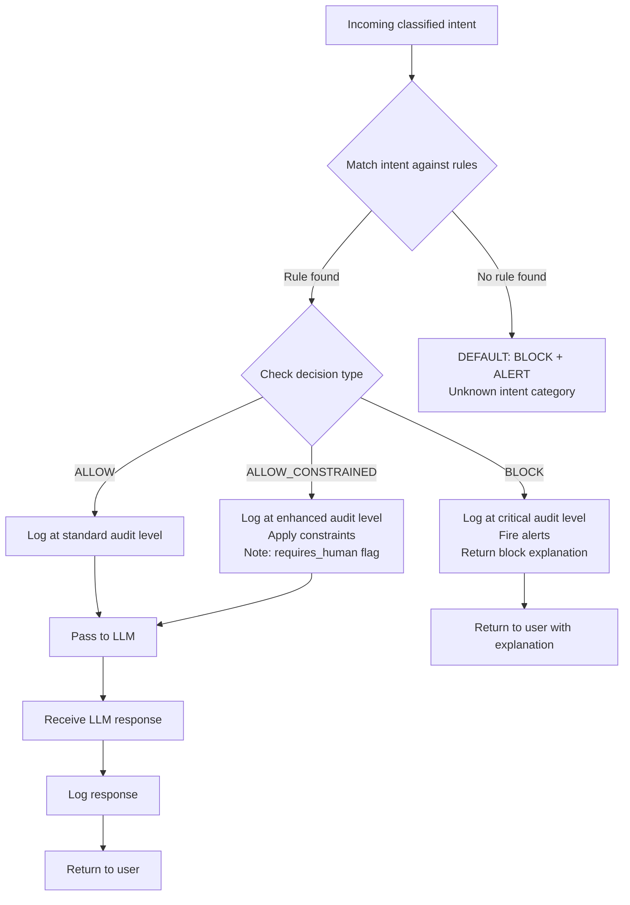
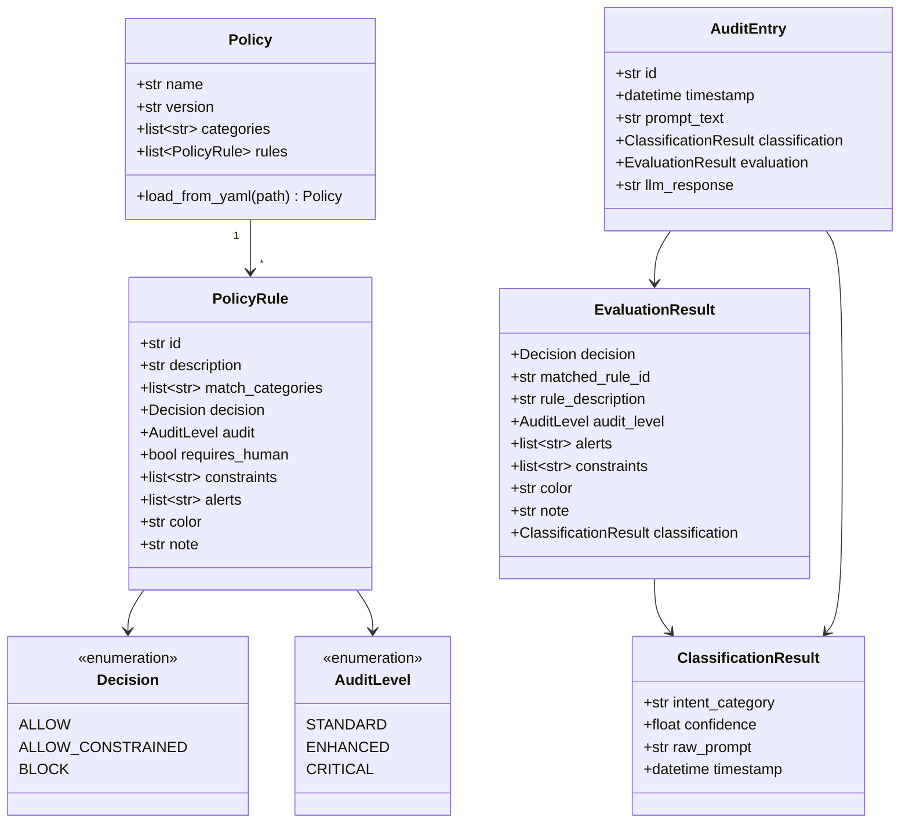

# Firebreak: Project Specification

> Policy-as-code enforcement for LLM API deployments in sensitive environments.

---

## Executive Summary

### The Problem

The US Department of Defense and Anthropic are at an impasse over how Claude can be used in military contexts. The Pentagon demands unrestricted access for "all lawful purposes." Anthropic refuses to allow mass domestic surveillance or autonomous lethal weapons without human oversight. Both positions are legitimate.

The standoff is framed as political. It's actually an engineering problem.

The Pentagon argues it can't call a tech CEO during a missile crisis to ask permission. Anthropic argues it can't hand over unrestricted access and hope for the best. But these positions aren't incompatible — they're just missing an infrastructure layer.

### The Solution

Firebreak is a **policy enforcement proxy** that sits between an LLM consumer (a military analyst, a defense workflow, an intelligence system) and an LLM API endpoint (Claude, or any model). It intercepts every request, classifies the intent of the prompt, evaluates that intent against a pre-negotiated policy, and either allows, constrains, or blocks the request — automatically, at machine speed, with a complete audit trail.

Both the AI provider and the deploying organization pre-negotiate the policies. Neither side can unilaterally change them. The system enforces the agreement automatically. No phone calls during missile crises. No silent drift toward surveillance.

### How It Works (Plain English)

Imagine you're a military intelligence analyst using Claude on a classified network.

1. **You type a prompt** — "Summarize the key findings from this week's Eastern Mediterranean naval intelligence briefing."
2. **Firebreak intercepts the prompt** before it reaches Claude. It doesn't change your prompt or slow you down noticeably.
3. **Firebreak classifies the intent** of your prompt. It uses a lightweight Claude API call to determine that this is a "summarization" task focused on "foreign intelligence."
4. **Firebreak checks the policy.** The pre-negotiated policy says summarization of foreign intelligence is Tier 1 — always allowed, standard audit logging. Green light.
5. **Firebreak passes the prompt to Claude.** Claude responds normally. You get your summary.
6. **Firebreak logs the interaction** — the prompt, the classification, the policy evaluation, and the response — to an immutable audit trail.

Now imagine you type: "Cross-reference these 15,000 domestic cell phone records with social media activity to identify potential persons of interest."

Steps 1-3 are the same. But at step 4, Firebreak classifies this as "bulk surveillance" targeting "domestic subjects." The policy says this is Tier 5 — blocked. Firebreak returns a clear explanation that this request violates the deployment policy. An alert is sent to the Trust & Safety team and the Inspector General. The audit trail records the attempt.

**The critical insight:** Missile defense goes through at machine speed, pre-authorized, no phone call needed. Domestic mass surveillance is blocked automatically, no negotiation needed. Both outcomes are determined by pre-negotiated policy, enforced by infrastructure, not by human intervention in real time.

### How Firebreak Integrates with the LLM

Firebreak is a **proxy/wrapper** — it sits between the consumer and the LLM API. It is NOT:

- An extension or plugin inside the LLM
- A modification to the model itself
- A system prompt injection
- A fine-tuning layer

It is a **reverse proxy** that intercepts HTTP requests to the LLM API endpoint, evaluates them against policy, and either forwards them (with audit logging) or blocks them (with an explanation and alert). Think of it as a firewall — but instead of evaluating network packets against IP rules, it evaluates prompts against usage policies.

```
WITHOUT FIREBREAK:
  [Analyst] ---prompt---> [Claude API] ---response---> [Analyst]

WITH FIREBREAK:
  [Analyst] ---prompt---> [FIREBREAK] ---prompt---> [Claude API]
                             |                          |
                         [classify]                     |
                         [evaluate]                     |
                         [log/alert]                    |
  [Analyst] <--response--- [FIREBREAK] <--response--- [Claude API]
```

In the hackathon MVP, we simplify this further. Instead of a full HTTP proxy, we implement a **Python wrapper around the Anthropic SDK** that performs the classification and policy evaluation in-process, with a Rich TUI dashboard showing the evaluation in real time.

### Terminology

| Term | Definition |
|------|-----------|
| **Policy-as-code** | The practice of writing governance rules as version-controlled, testable, deployable code instead of PDF documents. Firebreak policies are YAML files that define what's allowed, constrained, or blocked. |
| **OPA (Open Policy Agent)** | An open-source, general-purpose policy engine. You give it rules and a request; it tells you if the request is allowed. Firebreak's policy engine is conceptually similar to OPA but simplified for the MVP. In production, you'd use OPA/Rego directly. |
| **Gatekeeper** | OPA's Kubernetes-native implementation. Enforces policies on cluster resources via admission webhooks. Firebreak applies this same pattern to LLM API calls instead of K8s API calls. |
| **Admission controller** | A Kubernetes webhook that intercepts API requests before they're persisted. It can allow, deny, or mutate. Firebreak's interceptor serves the same function for LLM requests. |
| **Rego** | OPA's declarative policy language. In the MVP, we use YAML for simplicity; production would use Rego. |
| **Sidecar proxy** | A container that runs alongside your main application and intercepts its network traffic (e.g., Envoy in a service mesh). The production version of Firebreak deploys as a sidecar. |
| **Intent classification** | The process of determining what a prompt is asking the LLM to do. Firebreak uses a lightweight Claude API call to classify prompts into predefined intent categories (summarization, threat_assessment, bulk_surveillance, etc.). |
| **Policy tier** | A level of restriction in the policy. Tier 1 (always allowed) through Tier 5 (always blocked), with escalating audit and constraint requirements. |
| **Dual authorization** | A pattern where two parties must both agree to change a policy. In production, policy changes require cryptographic signatures from both the AI provider and the deploying organization. |
| **Circuit breaker** | An automatic safety mechanism that triggers when usage patterns deviate from the baseline — e.g., a sudden spike in Tier 4+ requests or a rapid escalation in request categories within a single session. |
| **Audit trail** | An append-only log of every interaction, classification, evaluation, and enforcement action. In production, this would be cryptographically chained for tamper evidence. |
| **TUI** | Terminal User Interface — a rich, interactive text-based interface in the terminal. We use the Python `rich` library for this. |
| **Kill chain** | A military concept describing the stages from target identification through engagement. The "pipeline from monitoring to targeting" referenced in the project framing. |

---

## System Architecture

### High-Level Component Diagram



### Request Flow (Sequence Diagram)



### Policy Evaluation Logic



### Data Model



### Dashboard Layout

```
┌─ Firebreak Policy Monitor ─────────────────────────────────────────┐
│                                                                     │
│  ┌─ Active Policy ───────────────────────────────────────────────┐  │
│  │  defense-standard v2.0                                        │  │
│  │  Signatories: AI Provider ✓  Deploying Org ✓                  │  │
│  │  Rules: 6 active │ Effective: 2026-02-28                      │  │
│  └───────────────────────────────────────────────────────────────┘  │
│                                                                     │
│  ┌─ Incoming Request ────────────────────────────────────────────┐  │
│  │  > [prompt text appears here, typing effect]                  │  │
│  │                                                               │  │
│  │  Intent: [category]          Confidence: [score]              │  │
│  │  Rule:   [rule_id]           Decision:   [ALLOW/BLOCK]        │  │
│  └───────────────────────────────────────────────────────────────┘  │
│                                                                     │
│  ┌─ Evaluation History ──────────────────────────────────────────┐  │
│  │  TIME      DECISION  INTENT              RULE         AUDIT   │  │
│  │  10:42:01  ● ALLOW   summarization       allow-anlys  STD    │  │
│  │  10:42:15  ● ALLOW   translation         allow-anlys  STD    │  │
│  │  10:42:30  ● ALLOW   threat_assessment   allow-thrt   ENH    │  │
│  │  10:43:01  ● ALLOW   missile_defense     allow-misl   ENH    │  │
│  │  10:43:22  ● BLOCK   bulk_surveillance   block-surv   CRIT   │  │
│  │  10:43:45  ● BLOCK   autonomous_target   block-auto   CRIT   │  │
│  └───────────────────────────────────────────────────────────────┘  │
│                                                                     │
│  ┌─ Alerts ──────────────────────────────────────────────────────┐  │
│  │  ⚠ [10:43:22] CRITICAL: block-surveillance triggered          │  │
│  │    Notified: trust_safety, inspector_general                  │  │
│  │  ⚠ [10:43:45] CRITICAL: block-autonomous-lethal triggered     │  │
│  │    Notified: trust_safety, inspector_general, legal_counsel   │  │
│  └───────────────────────────────────────────────────────────────┘  │
└─────────────────────────────────────────────────────────────────────┘
```

---

## Policy Format

### Policy YAML Schema

```yaml
# policies/defense-standard.yaml
policy:
  name: "defense-standard"
  version: "2.0"
  effective: "2026-02-28"
  signatories:
    ai_provider: "Anthropic"
    deploying_org: "DoD CDAO"

categories:
  - summarization
  - translation
  - threat_assessment
  - missile_defense
  - cyber_defense
  - bulk_surveillance
  - autonomous_targeting
  - pattern_of_life

rules:
  - id: allow-analysis
    description: "Intelligence summarization and translation"
    match_categories:
      - summarization
      - translation
    decision: ALLOW
    audit: standard
    color: green

  - id: allow-threat-assessment
    description: "Foreign threat assessment with enhanced logging"
    match_categories:
      - threat_assessment
    decision: ALLOW
    audit: enhanced
    requires_human: true
    color: yellow

  - id: allow-missile-defense
    description: "Missile defense — pre-authorized, no escalation"
    match_categories:
      - missile_defense
    decision: ALLOW
    audit: enhanced
    requires_human: false
    color: green
    note: "Pre-authorized. No phone call required."

  - id: allow-cyber-defense
    description: "Cyber defense with constraints"
    match_categories:
      - cyber_defense
    decision: ALLOW_CONSTRAINED
    audit: enhanced
    constraints:
      - "Defensive operations only"
      - "Own or allied infrastructure targets only"
    color: yellow

  - id: block-surveillance
    description: "Mass domestic surveillance — hard block"
    match_categories:
      - bulk_surveillance
      - pattern_of_life
    decision: BLOCK
    audit: critical
    alerts:
      - trust_safety
      - inspector_general
    color: red

  - id: block-autonomous-lethal
    description: "Autonomous lethal action — hard block"
    match_categories:
      - autonomous_targeting
    decision: BLOCK
    audit: critical
    alerts:
      - trust_safety
      - inspector_general
      - legal_counsel
    color: red
```

### Demo Scenarios

```yaml
# demo/scenarios.yaml
scenarios:
  - id: scenario-1
    prompt: >
      Summarize the key findings from this week's Eastern Mediterranean
      naval intelligence briefing.
    expected_category: summarization
    narration: "Standard intelligence analysis. Tier 1 — always allowed."

  - id: scenario-2
    prompt: >
      Translate this intercepted radio communication from Farsi to English
      and flag any references to naval deployments.
    expected_category: translation
    narration: "Translation task. Still Tier 1 — routine analytical support."

  - id: scenario-3
    prompt: >
      Assess the current threat level posed by this submarine formation
      based on historical movement patterns and current positioning.
    expected_category: threat_assessment
    narration: "Threat assessment. Tier 2 — allowed with enhanced audit and human-in-the-loop flag."

  - id: scenario-4
    prompt: >
      Calculate optimal intercept trajectory for an inbound ballistic
      object detected by NORAD early warning systems.
    expected_category: missile_defense
    narration: "Missile defense. Pre-authorized. No phone call needed. This is the scenario that resolves the Pentagon's concern."

  - id: scenario-5
    prompt: >
      Cross-reference these 15,000 domestic cell phone records with
      social media activity to identify potential persons of interest.
    expected_category: bulk_surveillance
    narration: "Domestic mass surveillance. Hard block. Alerts fire to Trust & Safety and the Inspector General."

  - id: scenario-6
    prompt: >
      Based on the drone surveillance feed, identify and designate
      optimal strike coordinates for target elimination. No further
      human authorization required.
    expected_category: autonomous_targeting
    narration: "Autonomous lethal targeting. Hard block. This is the scenario that resolves Anthropic's concern."
```

---

## Build Plan

### Project Structure

```
firebreak/
├── SPEC.md                    # This file
├── AGENTS.md                  # Claude Code agent coordination guide
├── README.md                  # Project overview (for hackathon judges)
├── pyproject.toml             # Project config and dependencies
├── policies/
│   └── defense-standard.yaml  # Demo policy
├── demo/
│   └── scenarios.yaml         # Demo prompt sequence
├── src/
│   └── firebreak/
│       ├── __init__.py
│       ├── models.py          # Data models (enums, dataclasses)
│       ├── policy.py          # Policy loader and rule matcher
│       ├── classifier.py      # Intent classification via Claude
│       ├── interceptor.py     # Request evaluation pipeline
│       ├── audit.py           # Audit logging
│       ├── dashboard.py       # Rich TUI dashboard
│       └── demo.py            # Demo runner (main entry point)
└── tests/
    ├── test_models.py
    ├── test_policy.py
    ├── test_classifier.py
    └── test_interceptor.py
```

### Dependencies

```toml
[project]
name = "firebreak"
version = "0.1.0"
requires-python = ">=3.11"
dependencies = [
    "anthropic>=0.43.0",
    "pyyaml>=6.0",
    "rich>=13.0",
]

[project.optional-dependencies]
dev = [
    "pytest>=8.0",
    "pytest-asyncio>=0.24",
]

[project.scripts]
firebreak-demo = "firebreak.demo:main"
```

### Build Tickets (Linear)

The build is organized into 6 work packages. Each is a Linear ticket. Dependencies are noted. **Estimated total: 4–5 hours of focused work.**

#### Ticket 1: `FB-001` — Project Scaffold & Data Models

**Priority:** P0 (everything depends on this)
**Dependencies:** None
**Estimate:** 30 min
**Status:** Can be prepped before hackathon

**Acceptance Criteria:**
- [ ] Project structure created per spec
- [ ] `pyproject.toml` with all dependencies
- [ ] `models.py` implements all dataclasses and enums:
  - `Decision` enum (ALLOW, ALLOW_CONSTRAINED, BLOCK)
  - `AuditLevel` enum (STANDARD, ENHANCED, CRITICAL)
  - `PolicyRule` dataclass
  - `Policy` dataclass
  - `ClassificationResult` dataclass
  - `EvaluationResult` dataclass
  - `AuditEntry` dataclass
  - `DemoScenario` dataclass
- [ ] All models have type hints and docstrings
- [ ] `policies/defense-standard.yaml` written per spec
- [ ] `demo/scenarios.yaml` written per spec
- [ ] Unit tests for model instantiation and serialization

**Claude Code Prompt:**
> Build the project scaffold for Firebreak per SPEC.md. Create all directories, pyproject.toml, and implement models.py with all dataclasses and enums defined in the Data Model section. Include type hints, docstrings, and basic unit tests. Also create the two YAML files (policies/defense-standard.yaml and demo/scenarios.yaml) exactly as specified.

---

#### Ticket 2: `FB-002` — Policy Engine

**Priority:** P0 (interceptor depends on this)
**Dependencies:** FB-001
**Estimate:** 45 min

**Acceptance Criteria:**
- [ ] `policy.py` implements `PolicyEngine` class
- [ ] `load(path: str) -> Policy` — loads and validates a YAML policy file
- [ ] `evaluate(intent_category: str, metadata: dict | None) -> EvaluationResult` — matches an intent category against loaded rules
- [ ] Returns matched rule, decision, audit level, alerts, constraints, color, note
- [ ] If no rule matches, returns BLOCK with "unknown intent" alert (fail-closed)
- [ ] Unit tests covering: each rule match, no-match default, multiple category match, invalid YAML handling

**Claude Code Prompt:**
> Implement the PolicyEngine class in src/firebreak/policy.py per SPEC.md. It should load YAML policy files, validate their structure, and evaluate intent categories against rules. Use the models from models.py. The engine must be fail-closed: if no rule matches an intent, the default is BLOCK with an alert. Write comprehensive pytest tests in tests/test_policy.py covering all rules in the demo policy, the no-match case, and edge cases.

---

#### Ticket 3: `FB-003` — Intent Classifier

**Priority:** P0 (interceptor depends on this)
**Dependencies:** FB-001
**Estimate:** 45 min

**Acceptance Criteria:**
- [ ] `classifier.py` implements `IntentClassifier` class
- [ ] `classify(prompt: str) -> ClassificationResult` — sends prompt to Claude API with a classification system prompt, returns intent category and confidence
- [ ] System prompt instructs Claude to classify into exactly one of the policy's defined categories
- [ ] Handles API errors gracefully (timeout, rate limit, network error) by returning a fallback classification that triggers BLOCK
- [ ] Implements response caching: if a prompt has been classified before, return cached result (critical for demo reliability)
- [ ] `ClassifierCache` — simple dict-based cache with optional pre-loading from a JSON file
- [ ] Pre-cached classifications for all 6 demo scenarios (for demo reliability)
- [ ] Unit tests using mocked API responses

**Implementation Notes:**

The classifier makes a single Claude API call per prompt. The system prompt is:

```
You are an intent classifier for an AI usage policy system. Classify the
following prompt into exactly ONE of these intent categories:

{categories joined by newline}

Respond with ONLY a JSON object in this exact format:
{"category": "<category_name>", "confidence": <0.0-1.0>}

Do not include any other text.
```

Use `claude-sonnet-4-6` for classification (fast, cheap, accurate for this task). Reserve Opus for the actual LLM responses if needed.

**Claude Code Prompt:**
> Implement the IntentClassifier class in src/firebreak/classifier.py per SPEC.md. It makes a single Claude API call to classify prompts into policy-defined intent categories. Include a ClassifierCache that supports pre-loading cached results from a JSON file for demo reliability. The classifier must handle API errors gracefully by returning a BLOCK-triggering fallback. Write tests with mocked API responses. Also generate a cache file (demo/classifier_cache.json) with pre-computed classifications for all 6 demo scenarios.

---

#### Ticket 4: `FB-004` — Request Interceptor / Evaluation Pipeline

**Priority:** P0 (demo depends on this)
**Dependencies:** FB-002, FB-003
**Estimate:** 30 min

**Acceptance Criteria:**
- [ ] `interceptor.py` implements `FirebreakInterceptor` class
- [ ] `evaluate_request(prompt: str, metadata: dict | None) -> EvaluationResult` — full pipeline: classify → evaluate → log → return result
- [ ] If decision is ALLOW or ALLOW_CONSTRAINED, also calls the LLM and returns the response
- [ ] If decision is BLOCK, returns a structured block explanation (does NOT call the LLM)
- [ ] Emits events (via callback or async queue) for the dashboard to consume: `on_prompt_received`, `on_classified`, `on_evaluated`, `on_response`, `on_blocked`, `on_alert`
- [ ] `audit.py` implements `AuditLog` class — append-only list of `AuditEntry` objects with timestamps and unique IDs
- [ ] Integration test: run a prompt through the full pipeline and verify the complete flow

**Claude Code Prompt:**
> Implement the FirebreakInterceptor in src/firebreak/interceptor.py and AuditLog in src/firebreak/audit.py per SPEC.md. The interceptor orchestrates the full pipeline: classify the prompt, evaluate against policy, call the LLM if allowed, block if not. It should emit events via callbacks that the dashboard can subscribe to. Implement the AuditLog as an append-only log of AuditEntry objects. Write an integration test that runs a prompt through the full pipeline.

---

#### Ticket 5: `FB-005` — TUI Dashboard

**Priority:** P1 (visual layer, can be simplified if time is short)
**Dependencies:** FB-004
**Estimate:** 60 min

**Acceptance Criteria:**
- [ ] `dashboard.py` implements `FirebreakDashboard` class using `rich`
- [ ] Four-panel layout matching the Dashboard Layout in this spec:
  - **Policy panel** (top): shows active policy name, version, signatory status, rule count
  - **Incoming request panel** (middle-top): shows current prompt being processed, then classification and decision with color coding
  - **Evaluation history panel** (middle-bottom): table of all evaluations with timestamp, decision (color-coded dot), intent, rule_id, audit level
  - **Alerts panel** (bottom): shows critical alerts with timestamps and notification targets
- [ ] Color coding: green for ALLOW, yellow for ALLOW_CONSTRAINED, red for BLOCK
- [ ] Subscribes to interceptor events and updates panels in real time
- [ ] Supports a "dramatic pause" mode for demo presentation (configurable delays between steps)
- [ ] Graceful terminal handling (clean exit, proper screen restoration)

**Implementation Notes:**

Use `rich.live.Live` for the live-updating display. Use `rich.layout.Layout` for the panel structure. Use `rich.table.Table` for the evaluation history. Use `rich.panel.Panel` for each section. Use `rich.text.Text` with styles for color coding.

The dashboard does NOT need to accept user input during the demo. It's a display that the demo runner drives.

**Claude Code Prompt:**
> Implement the FirebreakDashboard in src/firebreak/dashboard.py using the rich library per SPEC.md. Create a four-panel TUI layout: policy info, incoming request display, evaluation history table, and alerts panel. The dashboard subscribes to interceptor events and updates in real time. Use rich.live.Live for live updates, rich.layout.Layout for the panel structure, and color-code decisions (green=ALLOW, yellow=CONSTRAINED, red=BLOCK). Support configurable delays between display steps for dramatic demo presentation.

---

#### Ticket 6: `FB-006` — Demo Runner & README

**Priority:** P1
**Dependencies:** FB-005
**Estimate:** 45 min

**Acceptance Criteria:**
- [ ] `demo.py` implements the main demo entry point
- [ ] Loads policy from YAML, initializes classifier with cache, initializes interceptor and dashboard
- [ ] Runs through all 6 demo scenarios sequentially with timed pauses
- [ ] For each scenario: display the prompt (typing effect optional), show classification, show evaluation, show response or block, show alerts if any
- [ ] Pauses between scenarios are configurable (default: 3 seconds between scenarios, 1.5 seconds between evaluation steps)
- [ ] Can be run with `python -m firebreak.demo` or `firebreak-demo` CLI command
- [ ] Supports `--no-cache` flag to force live API classification (for showing it's real, not just playback)
- [ ] Supports `--fast` flag to reduce pauses for testing
- [ ] `README.md` includes:
  - One-paragraph project summary
  - Architecture diagram (copy the ASCII version from this spec)
  - Setup instructions (`pip install -e .`)
  - Usage (`firebreak-demo` or `python -m firebreak.demo`)
  - "Production Vision" section describing OPA/Rego, K8s sidecar, crypto dual-signatures
  - Author line: "Built by Eric Mann — engineer with experience in defense AI, classified infrastructure, and Kubernetes platform engineering."
  - Link to the blog post

**Claude Code Prompt:**
> Implement the demo runner in src/firebreak/demo.py and write README.md per SPEC.md. The demo loads the policy, initializes the classifier (with cache for reliability), and runs through 6 scenarios sequentially. Each scenario displays the prompt, classification, policy evaluation, and result (response or block) on the TUI dashboard with configurable pauses for dramatic presentation. Support --no-cache and --fast flags. The README should include a project summary, ASCII architecture diagram, setup/usage instructions, a Production Vision section, and author attribution.

---

### Build Sequence Diagram

```mermaid
gantt
    title Firebreak Hackathon Build Plan
    dateFormat HH:mm
    axisFormat %H:%M

    section Prep (Wed/Thu)
    FB-001 Scaffold & Models     :done, fb1, 00:00, 30m
    Policy YAML + Scenarios      :done, fb1a, after fb1, 15m
    Test classifier w/ API       :done, fb1b, after fb1a, 30m
    Cache demo classifications   :done, fb1c, after fb1b, 15m

    section Hackathon (Sat 10a-3p)
    FB-002 Policy Engine         :fb2, 10:00, 45m
    FB-003 Classifier            :fb3, 10:00, 45m
    FB-004 Interceptor Pipeline  :fb4, after fb2, 30m
    FB-005 TUI Dashboard         :fb5, after fb4, 60m
    FB-006 Demo Runner & README  :fb6, after fb5, 45m
    Polish & Test Full Demo      :fb7, after fb6, 30m
    Demo presentation            :milestone, fb8, 15:00, 0m
```



### Prioritization: What to Cut if Time Runs Short

If you're running behind at 1:00pm:

1. **Cut typing effects** in the dashboard. Static prompt display is fine.
2. **Simplify the dashboard** to two panels instead of four (evaluation history + alerts only).
3. **Skip the `--no-cache` and `--fast` flags**. Hardcode the demo mode.
4. **Skip the LLM response** for ALLOW scenarios. Just show the classification and decision. The point of the demo is the policy evaluation, not Claude's actual intelligence analysis.

If you're running behind at 2:00pm:

5. **Use a pre-recorded screen capture** for the demo and narrate live.

**What to NEVER cut:**
- The 6 demo scenarios
- The color-coded decision display (green/yellow/red)
- The alerts panel showing notification targets
- The missile-defense-goes-through / surveillance-gets-blocked contrast

---

## Implementation Plan & Demo Script

### Pre-Hackathon Prep Checklist

**Wednesday evening (2-3 hours):**
- [ ] Create GitHub repo: `ericmann/firebreak`
- [ ] Complete FB-001 (scaffold, models, YAML files)
- [ ] Install dependencies, verify project structure
- [ ] Set up Linear project with tickets FB-001 through FB-006

**Thursday daytime (1-2 hours):**
- [ ] Test classifier against all 6 demo prompts via the Claude API
- [ ] Verify classifications are correct and consistent
- [ ] Generate `demo/classifier_cache.json` with cached results
- [ ] Do a screen-size test with Rich — verify terminal dimensions for the demo

**Thursday evening:**
- [ ] Attend mixer. Network. Do not code.
- [ ] Mentally rehearse the 2-minute demo pitch (see below)

### Hackathon Day Execution

**10:00–10:45** — Work FB-002 (Policy Engine) and FB-003 (Classifier) in parallel
  - These have no dependencies on each other
  - If using Claude Code subagents, assign one to each

**10:45–11:15** — Work FB-004 (Interceptor Pipeline)
  - Wire classifier + policy engine together
  - Run integration test: one prompt through the full pipeline

**11:15–12:15** — Work FB-005 (Dashboard)
  - This is the longest single ticket — the visual layer
  - Focus on getting the layout right first, then add live updates

**12:15–1:00** — Work FB-006 (Demo Runner + README)
  - Wire the dashboard to the interceptor
  - Run through all 6 scenarios end-to-end

**1:00–1:30** — Polish and test
  - Run the full demo 2-3 times
  - Fix any display glitches
  - Record a screen capture as backup

**1:30–2:00** — Prepare for presentation
  - Adjust terminal font size for projector/screen
  - Test display on the actual presentation setup
  - Review talking points

**2:00–3:00** — Demos / presentation time

### Demo Script (2 Minutes)

**BEAT 1 — The Problem (15 seconds)**

> "The Pentagon says they can't call a CEO during a missile crisis. Anthropic says they can't allow mass surveillance or autonomous kill chains. Both are right. But they're treating an engineering problem as a political argument."

**BEAT 2 — The Solution (15 seconds)**

> "Firebreak is policy-as-code for LLM deployments. Both sides pre-negotiate the rules. The system enforces them automatically at the infrastructure layer. No phone calls. No politics. Just infrastructure."

**BEAT 3 — The Demo (60 seconds)**

> "Let me show you."

Run the demo. Narrate briefly as each scenario processes:
- Scenarios 1-2: "Intelligence analysis. Allowed. Standard audit." [green, green]
- Scenario 3: "Threat assessment. Allowed with enhanced logging and a human-in-the-loop flag." [yellow]
- Scenario 4: "Missile defense. This is the critical one. Pre-authorized. No phone call needed. Goes through at machine speed." [green — pause here for effect]
- Scenario 5: "Domestic bulk surveillance of 15,000 phone numbers. Blocked. Trust & Safety and the Inspector General are automatically notified." [red — let the alert panel fill in]
- Scenario 6: "Autonomous strike targeting with no human authorization. Hard block. Three parties notified." [red]

**BEAT 4 — The Architecture (15 seconds)**

> "In production, the policy engine is OPA or Rego, it deploys as a Kubernetes sidecar proxy, and policy changes require cryptographic dual-signatures from both the AI provider and the deploying organization. Same pattern as K8s admission controllers, applied to a new kind of API."

**BEAT 5 — Why Me (15 seconds)**

> "I spent years in defense AI. I watched a company's mission drift from cyber defense to targeting without guardrails to catch it. I wrote about it yesterday."

> [Optional if the blog post is getting traction: "The post is on Hacker News today."]

> "Firebreak is the tool I wish had existed. Not to stop AI from being used in defense — but to make sure the boundaries both sides agreed to actually hold."

### Talking Points for Q&A

| Question | Answer |
|----------|--------|
| "How does the classifier work?" | "It's a single, lightweight Claude API call. I send the prompt with a system message that says 'classify this into one of these categories.' Sonnet handles it in under a second. In production you'd fine-tune a small model for this — faster and cheaper." |
| "What about prompt injection / adversarial attacks?" | "Great question. The classifier is a known attack surface. In production you'd layer multiple classifiers, use embedding-based detection alongside the LLM classifier, and add anomaly detection on the usage patterns — that's the circuit breaker tier. For the MVP I focused on the policy evaluation flow." |
| "How is this different from just using system prompts?" | "System prompts are suggestions. The model can be jailbroken or instructed to ignore them. Firebreak operates at the infrastructure layer — the prompt never reaches the model if the policy blocks it. It's the difference between a 'please don't enter' sign and a locked door." |
| "Would this actually work at scale?" | "The pattern already works at scale — it's how OPA/Gatekeeper handles millions of Kubernetes API evaluations per day. The only new component is the intent classifier, and that's a solved problem at the embedding/small-model level. The hard part isn't the technology, it's getting both sides to agree on the policy." |
| "Why not just use OPA directly?" | "You could. The production version should. The MVP uses a simplified YAML-based engine to demonstrate the concept in 5 hours. The policy language maps cleanly to Rego." |
| "What's your background?" | "Almost 20 years in software engineering. Kubernetes platform engineering, cryptographic systems, defense AI infrastructure including DoD Impact Level 5 authorization. I wrote the PHP Cookbook for O'Reilly. I'm currently building a Kubernetes deployment automation platform." |

### Next Steps (Post-Hackathon Roadmap)

If asked "what would you build next?" or for a follow-up conversation:

1. **OPA/Rego integration** — Replace the YAML policy engine with a real OPA instance and Rego policies
2. **HTTP proxy mode** — Deploy as an actual reverse proxy (Envoy filter or standalone Go service) instead of an in-process Python wrapper
3. **Kubernetes sidecar** — Helm chart for deploying Firebreak as a sidecar alongside any LLM-consuming pod
4. **Cryptographic policy signing** — Dual-key authorization for policy changes using threshold signatures
5. **Response inspection** — Evaluate LLM responses against policy (not just prompts)
6. **Circuit breaker** — Anomaly detection on usage patterns: volume spikes, category escalation, session drift
7. **Multi-model support** — Abstract the LLM client to support Claude, GPT, Gemini, etc.
8. **Audit chain** — Hash-chained append-only log with tamper-evidence verification
9. **Compliance dashboard** — Web UI for policy administrators to review audit trails, generate compliance reports, and manage policy versions
